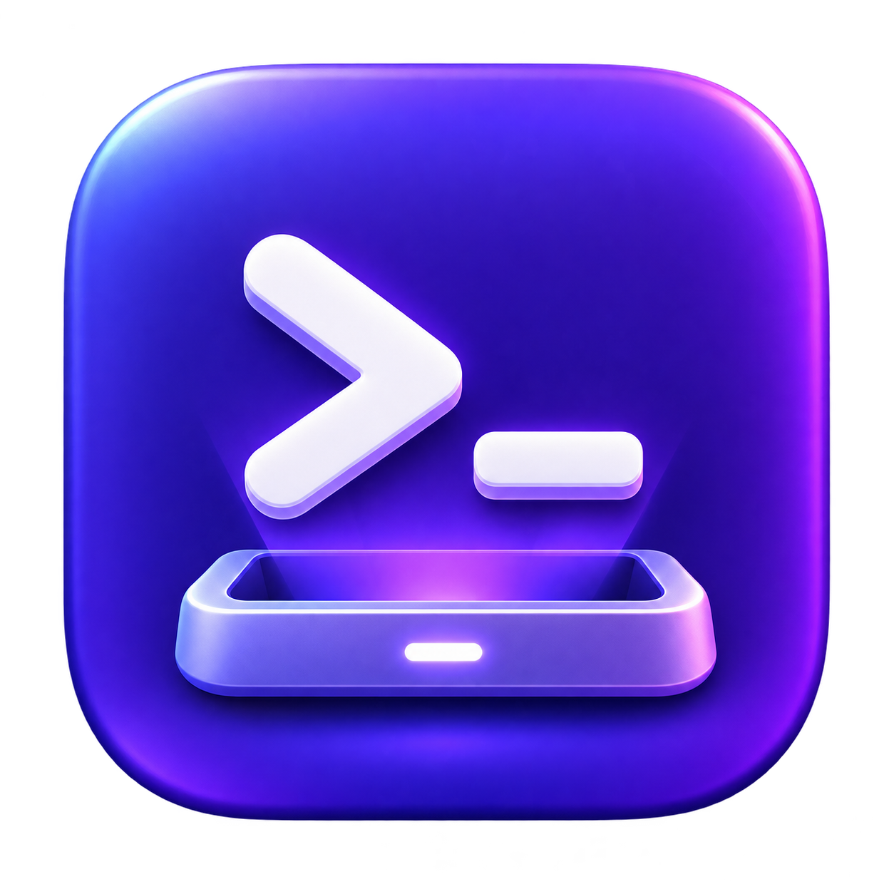
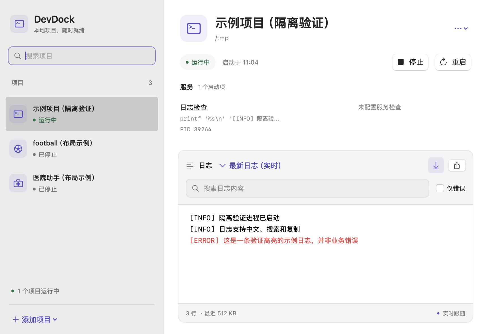

# DevDock · macOS 项目启动器



DevDock 是一个原生 macOS 菜单栏应用：把多个项目放进顶部菜单，点击即可后台启动，在一个窗口里查看服务状态与日志。使用 Swift、SwiftUI、AppKit 和系统进程 API，无第三方运行依赖。

本项目采用 [MIT 开源许可证](LICENSE)。

## 界面

界面采用原生 Mac 布局，随系统切换浅色与深色：淡灰侧栏、独立的项目图标、紫色强调色、清晰的服务状态和带搜索工具栏的日志面板。菜单栏面板根据项目数量调整高度；窗口支持缩放，保留原生键盘操作和文本选择。

下图为隔离示例项目的界面验证截图，不是实际业务状态。



[查看深色界面](docs/ui-dark.png)

更新构建会替换磁盘上的应用。正在运行的旧版继续使用原界面；等服务可以停止时，通过菜单退出 DevDock，再打开 `dist/DevDock.app` 即可切换新版。

## 环境要求

- macOS 13 或更新版本。
- 构建需要 Swift 5.9+，可以只安装 Xcode Command Line Tools，不要求完整 Xcode。
- 各业务项目仍需自己的 Go、Node.js、pnpm/npm 和数据库等依赖。DevDock 不替业务项目安装运行环境。
- 当前打包脚本构建本机架构：在 x86_64（Intel / AMD）macOS 上生成 x86_64 版本，在 Apple Silicon 上生成 arm64 版本。

## 启动应用

在本目录运行：

```bash
./dev
```

脚本会构建 Release 版本、生成并本地签名 `dist/DevDock.app`，然后打开项目窗口。也可以：

```bash
./scripts/build-app.sh
open dist/DevDock.app
```

双击 `dist/DevDock.app` 即可使用，也可以将它拖入“应用程序”。应用常驻菜单栏，不显示 Dock 图标。点击菜单栏的终端图标可展开项目列表；“项目与日志…”打开管理窗口，关闭窗口后服务继续运行。退出应用会停止本次由 DevDock 启动的服务；如果服务停止失败，应用会保留窗口供处理。

这是供本机使用的 ad-hoc 签名构建，没有 Developer ID 签名或 Apple 公证。跨设备分发需要另外签名、公证及按目标架构构建。

### 0.1.2

新增紫色终端与底座应用图标。打包时使用 macOS 自带的 `sips` 和 `iconutil` 生成完整多尺寸 ICNS。

### 0.1.1

菜单栏项目列表增加重启按钮，运行中的项目可直接先停止再启动；启停过程中禁用重启，停止过程中禁用重复停止。

后台启动脚本退出后，最多等待 3 秒确认目标进程，避免 `nohup` 尚未切换到服务程序时误报启动失败。已在 AMD Ryzen 7 5800X / macOS 15.7.7 上验证 x86_64 构建和重启流程。

## 项目发现与配置

首次运行会读取当前用户下这三个已指定的位置，存在时自动添加，**不会自动启动**：

| 项目目录（相对用户主目录） | 启动方式 | 启动内容 |
| --- | --- | --- |
| `Documents/Game/wlsg-v2/君陌助手` | `./dev` | Go API 18110、React 控制台 15175 |
| `Documents/Work/football` | `./dev.sh` | Go API 9800、Web 9801、Admin 9802 |
| `Documents/Work/hospital-assistant-go` | 分别执行 `./go-start start-bg mini/admin`，再运行管理网页 | mini-api 8071、admin-api 8072、管理网页 5173；OT 演示 5174 默认关闭 |

点击左下角“添加项目”：

- **扫描项目目录**：选择单个项目或项目总目录，最多向下扫描三层。跳过隐藏目录、依赖目录、构建目录和符号链接。找到一个项目后，不把它的内部前后端重复添加为新项目。
- **手动添加**：选择目录，再编辑启动命令。

通用识别按 `dev`、`dev.sh`、`start.sh`、`go-start`、`mac-start` 的顺序查找入口；没有脚本时识别 `package.json` 的 `scripts.dev`，有 pnpm 锁文件则使用 pnpm，否则使用 npm。仅进行文件读取，不执行扫描到的脚本。

启动后，DevDock 会从系统监听信息中自动发现该启动项及其子进程实际使用的 TCP 端口，并显示本机访问地址，通常在下一轮状态刷新时出现（约 3 秒，服务编译时间另计）。一个 `./dev` 启动前端、后端和 admin 时，可以显示多个地址。自动发现以进程归属为依据，不按端口号猜测项目，也不需要先手填端口。IPv4 和 IPv6 地址分别识别。

自动发现的地址标记为 **监听中**，名称使用监听进程名；不会仅凭端口开放就声称 HTTP 服务已就绪，也不能自动知道 HTTPS、网页子路径或哪个端口是 admin。需要准确名称、HTTPS 或 `/health` 检查时，可补充下面的服务配置。

上表端口是三个已适配项目的默认配置。**自动识别不等于自动分配端口**：实际端口仍由业务脚本、环境变量或开发服务器决定。若 Vite 自动换到其他端口，新地址会被发现；若脚本固定端口并因冲突退出，需修改项目端口配置。DevDock 不会自动重写业务脚本。

项目右上角菜单 → **编辑启动配置**，可修改：

- 项目名称和绝对目录。
- 每个启动项的名称、工作目录、命令、是否随项目启动。
- 服务的打开地址和就绪检查地址，仅允许本机 HTTP(S) 地址。
- 已有日志文件的位置。
- 后台模式的停止命令、PID 文件、进程可执行文件路径。

工作目录、日志、PID、可执行文件支持相对项目目录的路径。启动命令本身是 shell 命令，只有点击启动时才会执行。路径参数单独传递给进程，不拼接进 shell 命令，支持中文、空格和单引号。

多个启动项按配置顺序执行；前一个带服务检查的启动项通过检查后，才继续下一个。医院助手的每个启动项也可以单独启停。一个原脚本拉起多个服务时，默认作为一个启动项整体启停，保留其原有的热更新和依赖顺序。

## 三个项目的适配边界

### 君陌助手

直接运行原始 `./dev`，保留依赖安装、Go 热更新和健康检查。应用分别检查 Go `/health` 和控制台页面，避免把“热更新脚本仍在等待源码修复”误判为 API 正常。前后端目前共享原脚本的合并日志，未自动给每一行推测来源。

### football

直接运行原始 `./dev.sh`，保留后端就绪后再启动 Web/Admin 的行为。应用为脚本使用独立进程组，停止时先发送 TERM，仍存活时再发送 KILL，覆盖 `npx → Vite` 等子进程。

原脚本包含复用并重启 `launchctl` 后端的分支。当前 DevDock 对所有配置端口统一做占用检查，**不接管或重启已有外部后端**。如果 9800 已被常驻服务占用，界面提示冲突，需先用原有方式停止该服务再由 DevDock 启动。本版本三个端的输出仍是合并日志。

### 医院助手

原 `./go-start all` 只启动两个 API，不包含网页。DevDock 将两个 API 和管理网页列成三个启动项，调用 `start-bg` 后读取对应 PID 文件并核对可执行文件路径。两个 API 分别读取已有 `mini.log`、`admin.log`，管理网页使用应用捕获的独立日志。

`go-start` 会加载自己的 `.env.local`；发现规则使用脚本默认端口。若环境文件改变了 `APP_HOST`、`MINI_APP_PORT`、`ADMIN_APP_PORT`，请同步调整 DevDock 中的地址。管理网页端口通过命令明确指定为 5173，且启用 `--strictPort`。OT 演示可在配置里勾选启用。

## 状态与进程管理

- **已停止**：应用未管理该项目进程，且未检测到配置地址被占用。
- **正在启动 / 等待服务就绪**：启动命令、编译或服务检查正在进行。
- **已就绪**：应用管理的项目处于运行状态，全部配置地址属于该启动项的进程，且检查返回 HTTP 2xx/3xx。
- **运行中**：项目未配置服务检查，已确认进程存在；自动发现的地址单独显示“监听中”。
- **部分服务未就绪 / 需要关注**：仍有受管进程，但部分服务检查失败或发生错误。
- **端口被占用**：配置地址由其他启动项或外部进程监听；服务行显示“其他进程占用”，悬停可查看 PID，并禁用链接，避免打开另一个项目。
- **启动失败**：命令失败或后台进程退出，可查看日志排查。

启动前检查已配置端口。发生占用时提示 PID，保留现有进程。后台进程的 PID 文件必须与配置的可执行文件路径匹配。未知脚本若自行 `nohup` 后退出，需配置后台模式；不能靠启动脚本是否存活判断服务状态。

未配置的端口只能在服务开始监听后发现，无法据此提前阻止脚本内部行为。例如 `game-db-tool-v2/dev` 默认使用 8000 和 5173，其脚本自身会停止占用目标端口的进程；若需要与医院管理网页同时运行，请先通过该项目的 `DEV_WEB_PORT` 等配置避开重叠端口。DevDock 的状态识别修复不会改变原脚本的抢占行为。

就绪检查前后都会核对监听进程归属；即使其他项目在相同端口返回 HTTP 成功，也不会将当前项目标记为就绪。采样失败时清除端口状态，后续刷新重新识别。仅自动展示可映射到本机回环地址的监听，不自动接管同名进程。

普通前台脚本必须让业务进程保持在自己的进程组内。自行创建新会话、交给 Docker/launchctl 等外部管理器的脚本，不能依靠普通进程组清理，需为其配置合适的后台管理方式。当前未提供 Docker 容器或任意系统服务的自动接管。

首次启动业务命令前，应用读取一次登录/交互 zsh 的环境，使 Homebrew、nvm、pnpm 等路径可用；不把环境变量写入配置或日志。随后业务命令在指定目录通过登录 zsh 运行。若 `.zshrc` 需要交互输入或主动启动程序，请移除这类副作用，或在项目命令中明确指定运行时路径。

## 日志

项目详情下方提供：

- “最新日志（实时）”以及按启动批次选择历史日志。
- 文本搜索、仅错误筛选、错误行高亮。
- 关闭自动滚动后保留阅读位置，仍持续接收日志。
- 原生文本选择与复制，以及导出整个当前日志文件。
- 窗口仅加载最近 512 KB，避免大日志阻塞界面。

应用捕获的日志每份达到约 5 MB 时轮转，保留上一份 `.previous`；每个启动项保留最近 20 份命令日志及对应轮转文件。外部项目自己维护的日志仅被读取，不由 DevDock 删除或轮转。医院脚本原本会在新启动时清空自己的服务日志，因此它的历史保留策略仍由该脚本决定。

stdout 和 stderr 被合并捕获，因此错误筛选是按关键词 `error/fatal/panic/失败/错误` 匹配，不代表完整的结构化日志级别。搜索和筛选只作用于当前加载的最近 512 KB，导出包含所选文件全部内容。

## 数据位置

```text
~/Library/Application Support/DevDock/
├── projects.json
└── Logs/
    └── <项目 UUID>/
        └── <启动项 UUID>/
            ├── <时间>-start-xxxx.log
            ├── <时间>-start-xxxx.log.previous
            └── <时间>-stop-xxxx.log
```

配置原子写入。读取损坏配置时保留原文件并报告错误，不用默认值覆盖。可修复文件，或备份并移走 `projects.json` 后重新打开应用。修改配置前应先停止项目。

不在业务仓库内生成 DevDock 配置，不修改原脚本、环境文件或业务代码。移除项目仅从列表移除，保留项目目录和已有日志。当前不持久化本次启动的进程归属；应用异常崩溃或被强制结束后，残留服务若占用已配置地址，会显示为端口被占用，未配置地址的残留进程不会自动认领。需用项目原方式停止后再启动，避免误接管。

## 开发与验证

```bash
# 开发编译
swift build

# 隔离运行检查：临时目录、sleep 和随机空闲端口的临时 HTTP 服务
./scripts/check.sh

# Release 打包
./scripts/build-app.sh

# 只读输出发现结果，不启动 GUI 或业务服务
.build/debug/DevDock --inspect /绝对项目目录
```

检查程序不依赖 XCTest，可在只有 Command Line Tools 的 Mac 上运行；端口回归检查使用 `/usr/bin/python3` 的标准库临时 HTTP 服务，应用本身不依赖 Python。共 10 组检查，覆盖只读发现、医院 API/网页区分、大输出管道与超时、中文目录、整组进程停止、后台进程归属与启停、配置持久化、动态端口发现、跨项目同端口误高亮、IPv4/IPv6 同端口和共享监听、日志轮转与 ANSI 清理。不会启动真实业务项目。

用于界面检查的隔离入口：

```bash
mkdir -p .build/ui-check
DEVDOCK_SUPPORT_DIR="$PWD/.build/ui-check/support" \
DEVDOCK_SCREENSHOT_DIR="$PWD/.build/ui-check" \
  .build/debug/DevDock --smoke-ui
```

它启动一个明确标记的临时日志输出与 sleep 进程，将浅色、深色及紧凑窗口和菜单视图渲染到 PNG，停止该临时进程并退出，不启动真实业务服务。`DEVDOCK_SUPPORT_DIR` 可用于隔离配置和日志，正式使用无需设置。

## 代码结构

| 文件 | 职责 |
| --- | --- |
| `Sources/DevDock/App.swift` | 应用生命周期、菜单栏、窗口、内部启动入口 |
| `Sources/DevDock/Models.swift` | 配置模型、校验、文件扫描与三个项目的识别 |
| `Sources/DevDock/Runtime.swift` | 进程组、命令输出、监听端口与 PID 归属、HTTP 检查、日志文件 |
| `Sources/DevDock/Store.swift` | 项目持久化、启停顺序、状态、日志来源 |
| `Sources/DevDock/Views.swift` | 菜单面板、项目界面、配置表单、日志窗口 |
| `scripts/` | 构建、打包和隔离检查 |
| `Tests/DevDockTests/DevDockTests.swift` | 可执行的隔离回归检查 |

## 常见问题

**点击启动提示找不到 go/pnpm/npm**：先在普通终端确认工具可用。检查 shell 配置是否在无终端时提前退出；也可在启动命令中使用工具绝对路径。

**命令成功但服务未就绪**：查看日志中的编译、数据库连接和依赖错误；确认检查地址与实际端口一致。已经启动的服务保留供排查，可点击停止后重试。

**提示端口已占用**：可能是其他终端或系统服务启动的项目。DevDock 不通过抢占端口来结束它，先用原有方式停止。

**日志没有按前后端分开**：君陌助手和 football 原脚本共用输出。本版准确保留合并日志；要逐服务分类，需要在项目中分别输出日志文件，或改成独立启动项并保留所需启动顺序。

**应用退出较慢**：它正在停止本次管理的进程。普通进程组先等待约 3 秒再强制清理；后台停止命令最多等待约 15 秒。不会为了快速关窗口而丢下未处理的受管服务。
